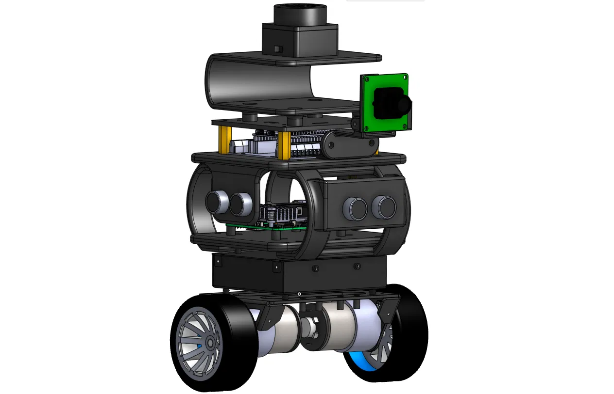

# PIVOT

**A two-wheeled self-balancing robot, built in simulation first.**

Project 01 of 12 in my robotics simulation lab — the AMR foundations slice.

<p align="center">
  
</p>

---

## Why a balancing bot first

The lab roadmap starts with a wheeled robot for one reason: it is the shortest path to a complete robotics system. URDF and Xacro, TF2, sensor plugins, ROS 2 nodes and topics, launch files, Gazebo — all of it gets exercised without simultaneously fighting legged dynamics or a flight stack. Every one of those pieces is reused in the manipulator, the UAV, and the quadruped later in the roadmap.

Pivot takes that starting point and makes it harder on purpose. A differential-drive robot on a caster is statically stable — it sits there whether or not your model is right. An inverted pendulum is not. If the centre of mass is misplaced, if the inertia tensor is wrong, if the collision geometry does not match the visual, the robot falls over and tells you immediately. The physics becomes a test for the model.

That is the trade: a steeper week one, in exchange for a simulation you can actually trust.

---

## The lab philosophy

> Learn from building. Read enough to unblock the next step, build the smallest version, debug it, measure it, document it, then move on.

Each project is a vertical slice, not a research system. The goal is not mastery of one robot — it is first-hand engineering exposure across morphologies and across the intelligence stack, from classical control through model-based, learning-based, and knowledge-based autonomy.

Every project ships the same evidence:

- a simulation that runs
- a reproducible repository
- an architecture diagram
- one measurable result
- a short demo
- **one documented failure and its fix**

That last one is not filler. The debugging is the learning.

---

## Status

Week 1 in progress.

| Milestone | State |
|---|---|
| CAD model, exported to STL | done |
| URDF/Xacro, full frame tree | done |
| Launch files, RViz config | in progress |
| Gazebo spawn, physics tuning | pending |
| Mass properties from CAD | placeholder values |
| Balance controller | project 02 |

Mass and inertia are currently uniform-box approximations. They will be replaced with values computed from the CAD once materials are assigned — the centre-of-mass height in particular, since it sets the pendulum's natural frequency and therefore every controller gain downstream.

---

## The robot

Modelled from scratch in CAD, taking the Yahboom microROS balancing car and the Aeromaddy pendulum bot as references.

| Property | Value |
|---|---|
| Overall footprint | 184.6 × 178 mm |
| Height, ground to top of LiDAR | 261.9 mm |
| Wheel diameter | 67 mm |
| Wheel width | 27 mm |
| Track, axle centre to axle centre | 151 mm |
| Drive | 2 × JGB37-520 gearmotor with encoder |

Sensing: 2D LiDAR on the top plate, camera facing forward, IMU near the axle line, three ultrasonic rangefinders for close-range obstacle and cliff detection.

---

## Frame tree

```
base_footprint
└── base_link                    axle centreline, chassis tower
    ├── left_wheel_link          continuous, Y
    ├── right_wheel_link         continuous, Y
    ├── lidar_link               fixed
    ├── imu_link                 fixed
    ├── camera_link              fixed
    │   └── camera_optical_link  fixed, −90/0/−90
    ├── ultrasonic_front_link    fixed,   0°
    ├── ultrasonic_left_link     fixed, +35°
    └── ultrasonic_right_link    fixed, −35°
```

Eleven links, ten joints, two of them movable.

---

## Design decisions

**`base_link` sits at the wheel axle, not at the chassis body.** The axle is the pitch axis — the one point that stays at constant height while the tower tips. Putting the frame there means differential-drive odometry integrates correctly, and the `base_footprint` → `base_link` transform *is* the tilt angle. Anywhere else and every pitch oscillation injects false translation into the position estimate.

**Wheel joints are `continuous`, not `revolute`.** A wheel has no travel limit. A revolute joint that stops at ±π looks like a robot with seized bearings.

**`imu_link` is near the axle, not on the top plate.** Mounting height is lever arm. The higher the IMU, the larger the tangential acceleration artefact it reads during a recovery manoeuvre — which is exactly the signal that corrupts the angle estimate you are trying to close the loop on.

**Collision geometry is a box, not the chassis mesh.** A full-detail mesh in the collision tree destroys the physics step rate. A balancing controller running at 200 Hz cannot afford that, and the box envelope is accurate enough for a robot whose only ground contact is two wheels.

**Two camera frames for one camera.** `camera_link` follows the ROS convention (X forward, REP-103); `camera_optical_link` follows the computer vision convention (Z forward). They sit at the same point and differ only in axis labelling. Skip the second one and every projected point cloud arrives rotated 90°.

---

## Build

This repository is the `pivot_description` package. Clone it into the `src/` directory of a ROS 2 workspace:

```bash
mkdir -p ~/pivot_ws/src
cd ~/pivot_ws/src
git clone https://github.com/Muhd-Mahmud/Pivot.git pivot_description

cd ~/pivot_ws
colcon build --packages-select pivot_description --symlink-install
source install/setup.bash
```

`--symlink-install` matters here — with it, editing a xacro or swapping a mesh takes effect without a rebuild.

Verify the description parses:

```bash
xacro $(ros2 pkg prefix pivot_description)/share/pivot_description/urdf/pivot.urdf.xacro
```

---

## Repository layout

```
pivot_description/
├── urdf/            Xacro description, macros, sensor definitions
├── meshes/          STL geometry exported from CAD
├── docs/            Renders, diagrams, screenshots
├── CMakeLists.txt
└── package.xml
```

---

## Week 1 definition of done

- [ ] Robot spawns from a single launch command
- [ ] TF tree is complete and correct
- [ ] Robot rests stably on the ground plane, no clipping
- [ ] IMU publishes on `/imu`
- [ ] One measured result recorded
- [ ] Architecture diagram in the repository
- [ ] One documented failure and its fix
- [ ] 30–90 second demo

---

## Next

**Project 02 — AMR autonomy.** SLAM and Nav2 on this chassis: map an environment, localise against a saved map, and navigate to goals. The balance controller itself lands alongside it, since a navigation stack on an inverted pendulum needs the inner loop closed before the outer one means anything.

The twelve-project arc runs from here through manipulation, aerial robotics, multi-UAV swarm exploration, legged locomotion, humanoid control, model-based control, and knowledge-based task planning, ending in a multi-robot embodied AI capstone.

---

## Environment

ROS 2 Jazzy · Gazebo · Ubuntu 24.04

---

## References

- [ROS 2 documentation](https://docs.ros.org/)
- [Gazebo documentation](https://gazebosim.org/docs/)
- [REP-103 — standard units and coordinate conventions](https://www.ros.org/reps/rep-0103.html)
- [Yahboom STM32 self-balancing robot](https://category.yahboom.net/products/sbr-stm32) — reference platform
